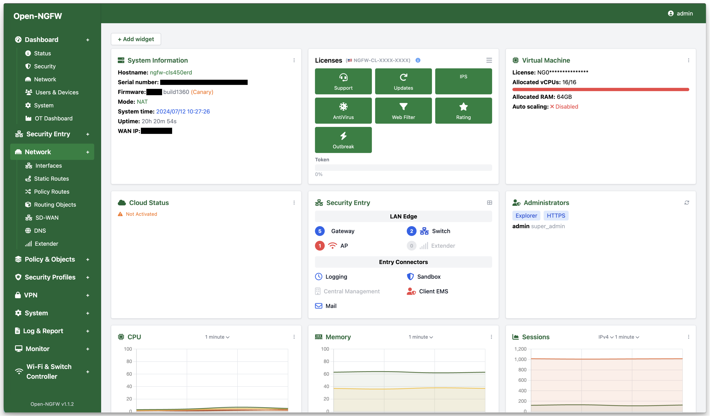

# Open-NGFW

A modern Next-Generation Firewall application built with Rust, featuring a web-based dashboard for network security management.

**Contact:** wtf@boringlab.io

## Sample Demo Dashboard



The dashboard provides a modern, enterprise-grade interface for firewall management with real-time monitoring, rule configuration, and network interface management.

## Features

- **Web Dashboard**: Modern, responsive interface with enterprise firewall-style design
- **Firewall Rules Management**: Add, delete, and toggle firewall rules
- **Network Interface Management**: Configure WAN/LAN interfaces
- **Real-time Statistics**: Monitor traffic and security events
- **RESTful API**: Full API for programmatic access
- **System Service**: Runs as a systemd service
- **Cross-platform**: Supports x86_64, ARM64, and ARMv7 architectures

## Quick Start

### Prerequisites

- Rust 1.75 or later
- Linux system with systemd
- Root privileges for installation

### Build and Install

1. **Clone and build:**
```bash
git clone <repository-url>
cd open-ngfw
chmod +x build-release.sh install.sh
./build-release.sh
```

2. **Install on target system:**
```bash
# Copy the appropriate package to your target system
scp dist/open-ngfw-0.1.0-native.tar.gz user@target:/tmp/

# On target system
cd /tmp
tar -xzf open-ngfw-0.1.0-native.tar.gz
sudo ./install.sh
```

3. **Access the dashboard:**
```
http://localhost:3000
```

## Architecture Support

The application supports multiple architectures:

- **x86_64**: Intel/AMD 64-bit processors
- **aarch64**: ARM 64-bit processors (Raspberry Pi 4, etc.)
- **armv7**: ARM 32-bit processors (older Raspberry Pi)

## Installation Options

### 1. Automated Installation (Recommended)

Use the provided installer script:
```bash
sudo ./install.sh
```

### 2. Docker Installation

```bash
# Build Docker image
docker build -t open-ngfw .

# Run container
docker run -d --name open-ngfw \
  -p 3000:3000 \
  --cap-add=NET_ADMIN \
  --cap-add=NET_RAW \
  open-ngfw
```

### 3. Manual Installation

```bash
# Build release binary
cargo build --release

# Create directories
sudo mkdir -p /opt/open-ngfw
sudo mkdir -p /etc/open-ngfw

# Copy files
sudo cp target/release/open-ngfw /opt/open-ngfw/
sudo cp -r static /opt/open-ngfw/
sudo cp open-ngfw.service /etc/systemd/system/open-ngfw.service

# Set permissions
sudo chown -R open-ngfw:open-ngfw /opt/open-ngfw
sudo chmod +x /opt/open-ngfw/open-ngfw

# Enable and start service
sudo systemctl daemon-reload
sudo systemctl enable open-ngfw
sudo systemctl start open-ngfw
```

## Configuration

The application configuration is stored in `/etc/open-ngfw/config.json`:

```json
{
    "server": {
        "host": "0.0.0.0",
        "port": 3000
    },
    "firewall": {
        "default_policy": "DROP",
        "log_level": "info"
    },
    "network": {
        "wan_interface": "eth0",
        "lan_interface": "eth1"
    }
}
```

## API Endpoints

### Firewall Rules
- `GET /api/rules` - List all rules
- `POST /api/rules` - Add new rule
- `DELETE /api/rules/:id` - Delete rule
- `POST /api/rules/:id/toggle` - Toggle rule status

### System Status
- `GET /api/status` - Get system status
- `POST /api/status/toggle` - Toggle firewall
- `GET /api/statistics` - Get statistics

### Network Management
- `GET /api/network/wan` - Get WAN status
- `POST /api/network/wan` - Configure WAN
- `GET /api/network/interfaces` - List interfaces

## Service Management

```bash
# Start service
sudo systemctl start open-ngfw

# Stop service
sudo systemctl stop open-ngfw

# Check status
sudo systemctl status open-ngfw

# View logs
sudo journalctl -u open-ngfw -f

# Restart service
sudo systemctl restart open-ngfw
```

## Development

### Prerequisites for Development

```bash
# Install Rust
curl --proto '=https' --tlsv1.2 -sSf https://sh.rustup.rs | sh

# Install cross-compilation tool (optional)
cargo install cross

# Install development dependencies
sudo apt-get install musl-tools  # For Ubuntu/Debian
```

### Build for Development

```bash
# Debug build
cargo build

# Release build
cargo build --release

# Run in development
cargo run
```

### Cross-compilation

```bash
# Install cross-compilation targets
rustup target add x86_64-unknown-linux-musl
rustup target add aarch64-unknown-linux-musl
rustup target add armv7-unknown-linux-musleabihf

# Build for specific target
cargo build --release --target x86_64-unknown-linux-musl
```

## Security Considerations

- The application runs as a dedicated `open-ngfw` user
- Systemd service includes security hardening
- Basic iptables rules are configured during installation
- Configuration files have restricted permissions

## Troubleshooting

### Common Issues

1. **Service won't start:**
   ```bash
   sudo journalctl -u open-ngfw -n 50
   ```

2. **Permission denied:**
   ```bash
   sudo chown -R open-ngfw:open-ngfw /opt/open-ngfw
   sudo chmod +x /opt/open-ngfw/open-ngfw
   ```

3. **Port already in use:**
   ```bash
   sudo netstat -tlnp | grep :3000
   sudo systemctl stop conflicting-service
   ```

### Logs

- Application logs: `sudo journalctl -u open-ngfw`
- Installation logs: `/var/log/open-ngfw-install.log`

## Contributing

1. Fork the repository
2. Create a feature branch
3. Make your changes
4. Add tests if applicable
5. Submit a pull request

## License

This project is licensed under the MIT License - see the LICENSE file for details.

## Support

For support and questions:
- Email: wtf@boringlab.io 